# Guide d'utilisation — Orford-sur-le-Lac · Entretien des sentiers

Bienvenue! Ce guide explique, étape par étape, comment utiliser le site
**Entretien des sentiers** d'Orford-sur-le-Lac. Il s'adresse aux membres
du comité et aux bénévoles. Aucune connaissance technique n'est requise —
on a essayé de tout illustrer.

> Le site fonctionne dans n'importe quel navigateur récent (Chrome, Safari,
> Firefox, Edge), sur ordinateur, tablette ou téléphone. **Pas de compte à
> créer** : consulter la carte et les corvées est totalement libre. Pour
> *envoyer* quelque chose, un simple **mot de passe partagé** est demandé une
> seule fois (voir « [Le mot de passe](#le-mot-de-passe) »).

## À quoi sert l'application

L'application permet trois choses :

1. **Signaler** un problème vu sur un sentier (arbre tombé, déchets,
   pancarte brisée, ravinement, etc.) — avec une photo et la position.
2. **Consulter la carte** des signalements pour voir où sont les
   problèmes, leur statut, et tous les détails.
3. **Organiser les corvées** — la page « Corvées » montre, en un coup
   d'œil, ce qui reste à faire par sentier et par type de tâche.

Toutes les pages se trouvent dans le bandeau du haut :

---

## 1. Signaler un problème

C'est la page d'accueil. Trois minutes suffisent pour faire un bon
signalement.

  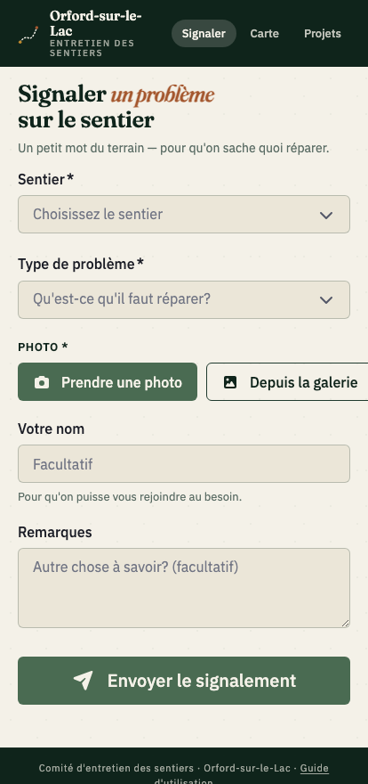

### Étape 1 — La photo et la position

**La photo et la position sont toutes deux obligatoires** : la photo
permet au comité de comprendre le problème, la position de se rendre
sur place.

1. Touchez **« Prendre une photo »** (caméra) ou **« Depuis la galerie »**
   (choisir une photo déjà prise).
2. **Le site lit automatiquement la position dans la photo** — la
   plupart des téléphones l'y enregistrent quand le GPS est activé. Si
   c'est trouvé, une ligne verte *« ✓ Position captée »* apparaît : c'est
   fait, vous n'avez rien d'autre à faire.
3. **Si la photo n'a pas de position**, le bloc *« Votre position »*
   s'affiche avec deux boutons :
   - **Capter ma position** — utilise le GPS de l'appareil (utile quand
     vous êtes encore sur place).
   - **Choisir sur la carte** — ouvre une mini-carte sur laquelle vous
     placez un repère à la main (utile si vous signalez plus tard, ou si
     l'appareil ne partage pas son GPS).

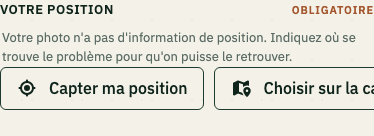

> **Astuce — Photos avec GPS.** Sur la plupart des téléphones, autoriser
> une fois l'app *Appareil photo* à utiliser le GPS suffit : toutes les
> photos prises ensuite porteront la position, et le site les utilisera
> automatiquement. Plus rapide que de ressaisir à chaque signalement.

> **Le signalement ne peut être envoyé sans photo ni sans position.**
> C'est voulu : un signalement incomplet est très difficile à traiter.

### Étape 2 — Choisir le sentier et la catégorie

- **Sentier** : sélectionnez le sentier concerné dans la liste. Si vous
  n'êtes pas sur un sentier identifié, choisissez « Autre sentier ».
- **Catégorie** : choisissez le type de problème (arbre tombé, déchets,
  pancarte abîmée, pont à réparer, érosion, etc.). Une icône s'affiche à
  côté pour vous aider à repérer la bonne catégorie.

### Étape 3 — Votre nom et une note

- **Notes** : décrivez brièvement (« planche cassée au milieu du pont »,
  « gros bouleau en travers »). C'est libre.
- **Votre nom** : pour qu'on puisse vous remercier ou vous reposer une
  question. **Il est mémorisé** : la prochaine fois, il sera déjà rempli.

### Étape 4 — Envoyer

Touchez **« Envoyer le signalement »**. **La première fois**, le site
demande le **mot de passe de la communauté** : tapez-le une fois, il est
mémorisé sur votre appareil et ne vous sera plus redemandé. Vous verrez
ensuite un message vert « Signalement envoyé. Merci beaucoup! » quand
c'est passé.

---

## 2. Comprendre la carte

La page **Carte** montre tous les signalements à leur position GPS.

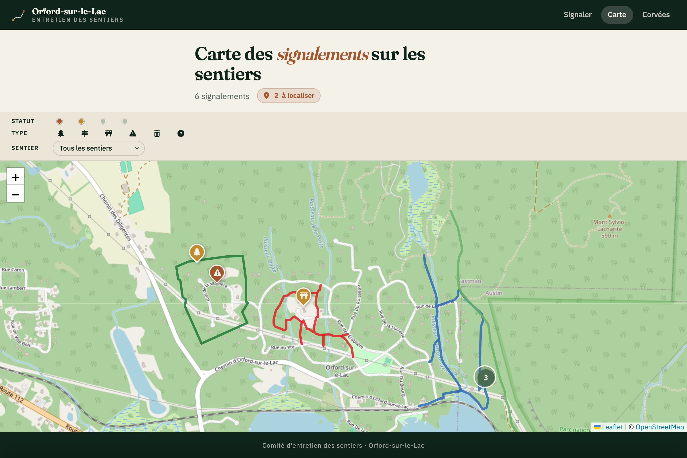

### Les pins

Chaque problème = un pin en forme de goutte. **La couleur** indique son
statut, **l'icône** à l'intérieur indique le type :

| Couleur            | Statut                                  |
|--------------------|------------------------------------------|
| Brun-rouge (clay)  | **Nouveau** — vient d'être signalé       |
| Orangé (ocre)      | **En cours** — quelqu'un s'en occupe      |
| Vert (mousse)      | **Clôturé** (Résolu ou Doublon)          |

Les pins très rapprochés sont **regroupés en bulle** avec le nombre :
zoomez (avec la molette ou en pinçant) ou cliquez sur la bulle pour la
déplier.

### La légende = vos filtres

La bande sous le titre regroupe trois filtres très compacts. **Cliquer
sur une pastille ou une icône affiche ou masque** les pins correspondants
sur la carte.

- **Statut** : 4 pastilles colorées (Nouveau, En cours, Résolu, Doublon).
  Par défaut, *Résolu* et *Doublon* sont masqués — la carte se concentre
  sur ce qui reste à faire.
- **Type** : 6 icônes (Nature, Signalisation, Infrastructure, Terrain,
  Déchets, Autre). Même principe : touchez pour afficher/masquer.
- **Sentier** : un menu déroulant pour ne voir qu'**un seul sentier** à
  la fois. Quand un sentier est choisi, **le tracé GPS des autres
  sentiers est aussi masqué** pour éviter le bruit.

> **Astuce — Connaître le nom d'une pastille ou d'une icône.** Survolez-la
> avec la souris (ou touchez-la sur mobile) : une petite étiquette
> apparaît juste au-dessus, comme dans l'exemple ci-dessous.

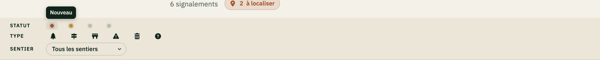

> **Astuce — Entrée grisée.** Une entrée grisée signifie qu'elle est
> masquée. Touchez-la à nouveau pour la réafficher.

### Le popup d'un signalement

Cliquez (ou touchez) un pin pour voir tous les détails :

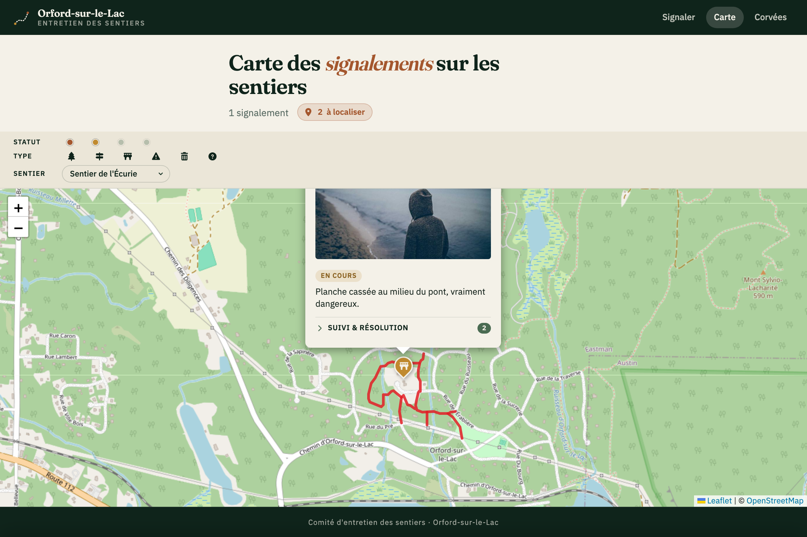

On y trouve, dans l'ordre :

1. **La photo** du problème.
2. **La catégorie** précise (ex. « Arbre tombé »).
3. **Le sentier et la date** sur une ligne soulignée en pointillés.
4. **Le badge de statut** (Nouveau, En cours, Résolu, Doublon).
5. **Les notes** du déclarant.
6. **Le nom du déclarant** (« Signalé par … »).
7. (Pour les signalements ouverts) **les boutons de clôture** : Résolu /
   Doublon.
8. **Le journal de suivi & résolution** (voir plus bas).

> **Astuce — Numéro de ligne.** Touchez la ligne *sentier · date* :
> une petite bulle apparaît avec **« ligne 42 »**. C'est le numéro de
> ligne dans la feuille Google : pratique pour éditer un signalement
> directement dans le tableur quand c'est nécessaire.

### Clôturer un signalement (mode comité)

Quand un problème est traité, le comité peut le clôturer **directement
depuis le popup**, sans toucher au tableur.

Deux motifs :

- **Résolu** — la tâche a été faite (arbre coupé, pancarte remise, etc.).
- **Doublon** — le signalement faisait double emploi avec un autre.

Une confirmation est demandée, puis le **mot de passe du comité** (la
première fois seulement — ensuite il est mémorisé sur l'appareil).
Après clôture, le pin disparaît de la carte (puisque les clos sont
masqués par défaut) — ou il devient vert si vous avez réactivé le
filtre Résolu/Doublon.

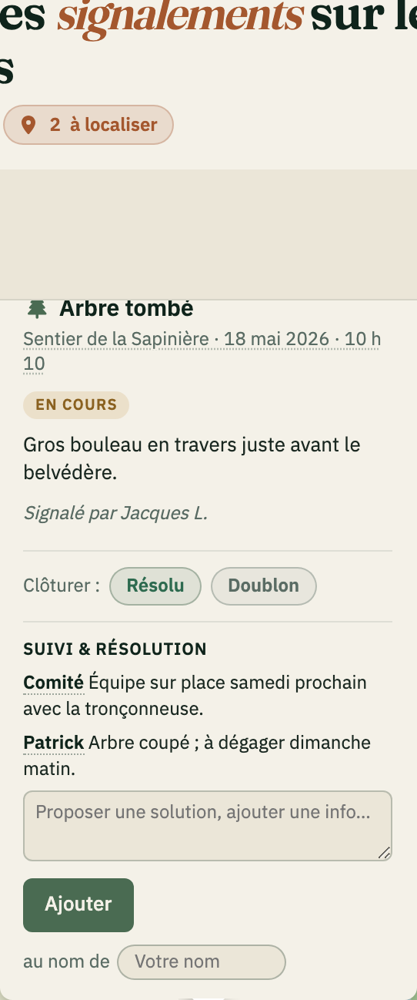

### Le journal de suivi & résolution

Tout en bas du popup, le **comité peut ajouter un suivi** : « j'irai samedi
matin », « bois commandé chez Patrick », « équipe sur place »… Le but est
de garder une trace publique de qui s'occupe de quoi. L'ajout d'un suivi
demande le **mot de passe du comité** (mémorisé après la première fois).

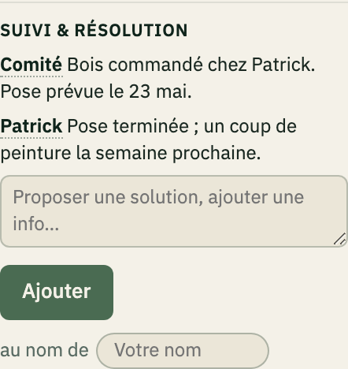

- **Écrivez votre message** dans le champ.
- À droite du bouton **Ajouter**, vous voyez **« au nom de ⟨ Jeremy ⟩ »**.
  C'est le nom mémorisé. Pour le changer ponctuellement, touchez la
  petite pastille avec votre nom — un champ s'ouvre pour le modifier.
- Touchez **Ajouter**. Votre suivi apparaît immédiatement, sous la forme
  **Votre Nom**(*date au survol*) suivi de votre message.

> **La date/heure est cachée** pour ne pas alourdir l'affichage. Elle
> apparaît en infobulle quand on survole le nom d'un auteur — ou au tap
> sur mobile.

### Les signalements « à localiser »

Quand un signalement n'a pas de position GPS (par exemple parce qu'il a
été envoyé sans GPS ou rapporté à un membre du comité oralement), il
n'apparaît pas sur la carte. Pour ne pas le perdre, le bandeau du haut
affiche un petit bouton orangé **« N à localiser »**.

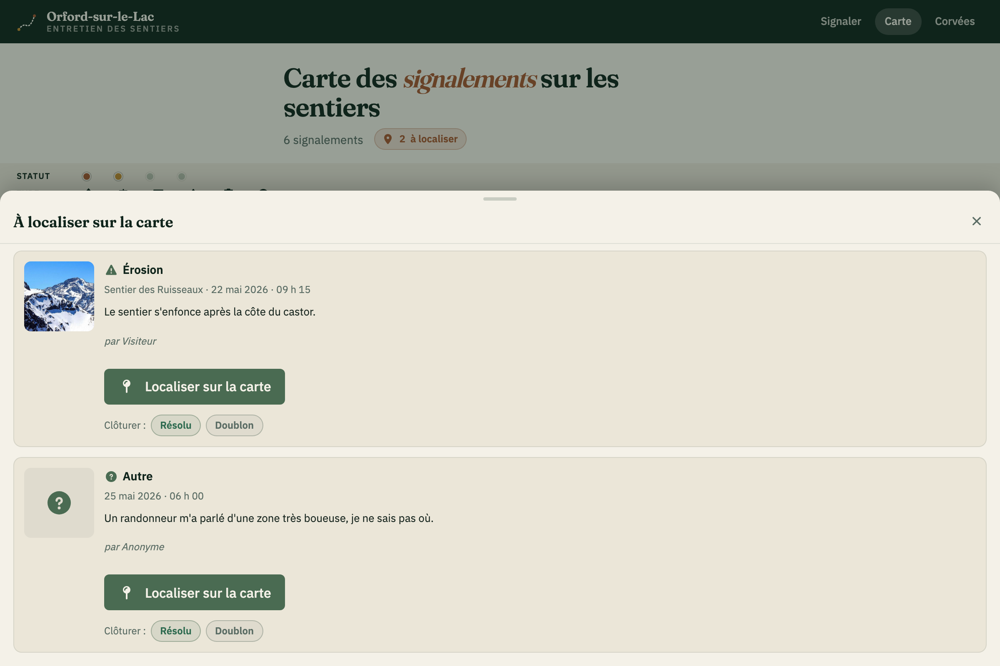

Touchez ce bouton pour ouvrir un tiroir avec la liste de ces
signalements. Pour chacun, deux gestes possibles :

- **Localiser sur la carte** — ouvre une mini-carte sur laquelle vous
  placez le repère ; touchez **Confirmer** pour enregistrer la position.
  Le signalement quitte alors la liste et apparaît sur la carte
  principale.
- **Résolu / Doublon** — si le signalement est déjà obsolète, vous pouvez
  le clôturer sans le localiser.

---

## 3. Comprendre la page Corvées

La page **Corvées** est l'outil d'organisation : elle montre, en un coup
d'œil, **qui a quoi à faire**.

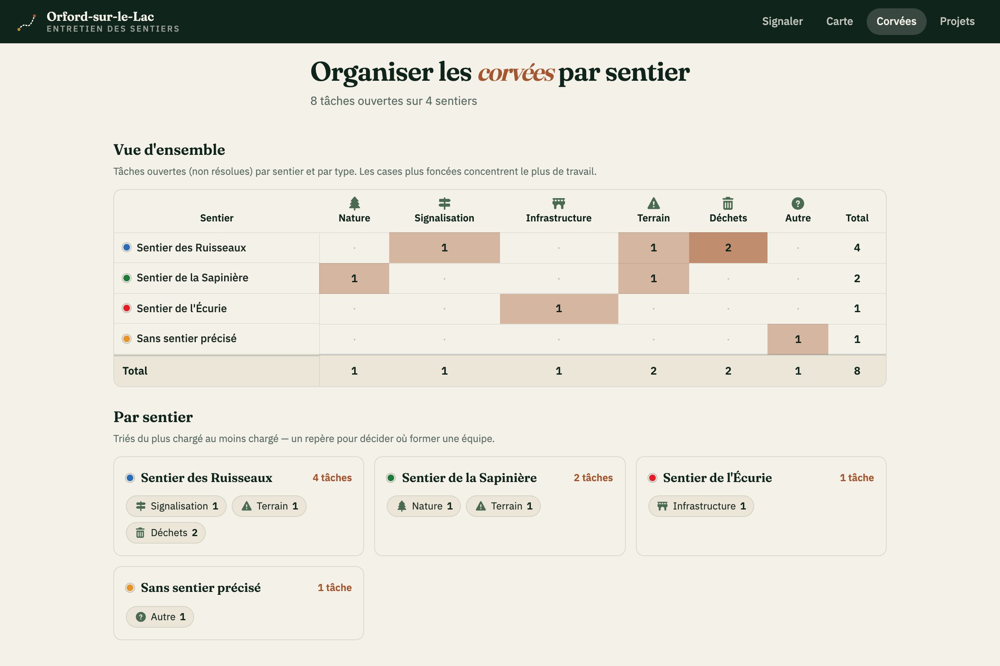

### La matrice sentier × type

Une grande grille : **les sentiers en lignes**, **les types de tâche en
colonnes** (Nature, Signalisation, Infrastructure, Terrain, Déchets,
Autre). Chaque case contient le **nombre de tâches ouvertes** de ce type
sur ce sentier.

- **Les cases plus foncées** concentrent le plus de travail — un signal
  visuel pour repérer les grappes.
- À la dernière colonne et à la dernière ligne, vous trouvez les
  **totaux** (par sentier, par type, et le grand total en bas à droite).

### Chaque chiffre est cliquable

Cliquer un nombre ouvre la **carte pré-filtrée** sur cette intersection.
Quelques exemples :

- Cliquer le **9** dans Sentier des Ruisseaux × Terrain → la carte
  affiche uniquement les tâches *terrain* du sentier des *Ruisseaux*.
- Cliquer un **total de ligne** → toutes les tâches du sentier (tous
  types).
- Cliquer un **total de colonne** → ce type sur tous les sentiers.
- Cliquer le **grand total** en bas à droite → la carte avec tout ce qui
  est ouvert.

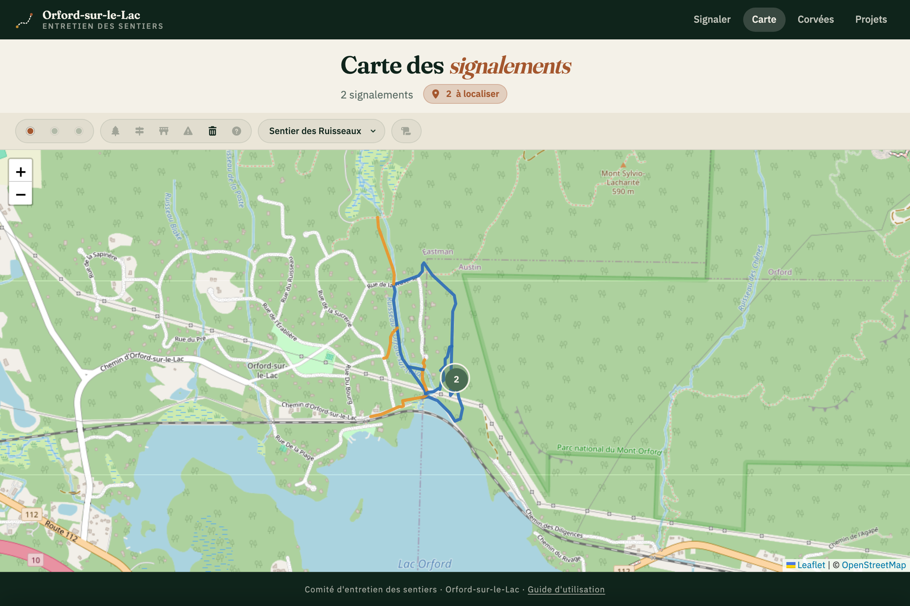

### Les cartes par sentier

Sous la matrice, on retrouve une **carte par sentier**, triée du plus
chargé au moins chargé. Chacune affiche :

- Une **pastille de couleur** (la couleur du sentier sur la carte).
- Le **nom du sentier** et le **nombre total** de tâches ouvertes.
- Une rangée de **chips** par type, avec le nombre — chacun aussi
  cliquable vers la carte filtrée.

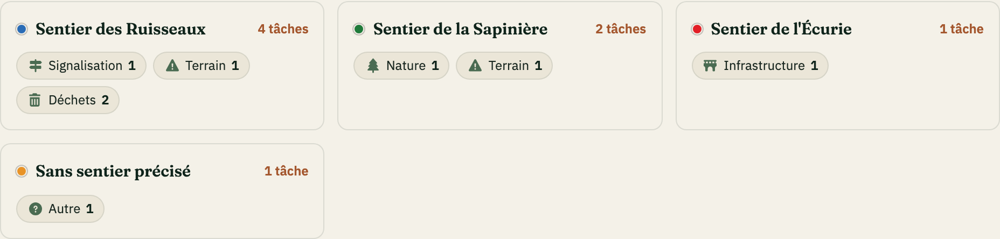

> **À noter — Localisé ou pas.** La matrice compte **toutes** les tâches
> ouvertes, même celles « à localiser ». La carte, elle, ne peut
> afficher que les tâches qui ont une position. Donc un « 9 » sur
> Corvées peut donner 7 pins sur la carte + 2 dans le tiroir
> « à localiser ». Pensez à vérifier les deux.

---

## 4. Bon à savoir

### Où sont les données

Tout est stocké dans une **feuille Google Sheets** : une ligne = un
signalement. Les photos sont sauvegardées dans un **dossier Google
Drive** lié à la feuille. Le site se contente d'afficher et de modifier
ce qui s'y trouve.

### Le mot de passe

Pour éviter les signalements indésirables, **écrire** dans l'application
demande un mot de passe — **consulter** reste toujours libre. Il y a deux
mots de passe, et le site reconnaît tout seul lequel vous tapez :

| Mot de passe | Donne accès à |
|---|---|
| **Communauté** | envoyer un signalement |
| **Comité** | tout : clôturer, suivi, placer un repère — *et* signaler |

Vous le tapez **une seule fois** : il est ensuite mémorisé sur votre
appareil. Un membre du comité qui aurait d'abord tapé le mot de passe
communauté se verra simplement redemander le mot de passe comité la
première fois qu'il fait une action de comité.

> Le mot de passe se communique de bouche à oreille / par courriel dans la
> communauté ; il n'est écrit nulle part dans le site. En cas d'abus, le
> comité peut le changer en quelques secondes dans la feuille Google.

### Qui peut faire quoi

- **Tout le monde** (avec le mot de passe communauté) : signaler, et bien
  sûr consulter la carte et les corvées sans aucun mot de passe.
- **Le comité** (avec le mot de passe comité) : clôturer un signalement,
  ajouter un suivi, et placer un repère sur un signalement « à localiser ».

### Le numéro de ligne

Tous les popups affichent discrètement un **« ligne N »** (en touchant
la ligne sentier · date). Ce numéro correspond à la ligne dans la
feuille Google : pratique quand on veut corriger un détail directement
dans le tableur (ex. modifier la priorité, ajouter une catégorie qui n'a
pas été choisie).

### Si quelque chose ne fonctionne pas

- **Le formulaire refuse d'envoyer** : vérifiez que vous avez bien
  ajouté une photo *et* une position. Les deux sont obligatoires.
- **« Échec de l'envoi »** : vérifiez votre connexion Internet, puis
  réessayez. La feuille Google peut être occasionnellement lente à
  répondre.
- **« Mot de passe incorrect » / « Action réservée au comité »** :
  vérifiez le mot de passe (communauté pour signaler, comité pour
  clôturer / suivi / placer un repère). Demandez-le à un membre du comité
  si besoin.
- **Un signalement n'apparaît pas sur la carte** : il est probablement
  dans le tiroir **« à localiser »** (sans GPS), ou son statut est
  *Résolu / Doublon* et donc masqué — réactivez ces filtres dans la
  légende pour le voir.

---

*Comité d'entretien des sentiers · Orford-sur-le-Lac*
